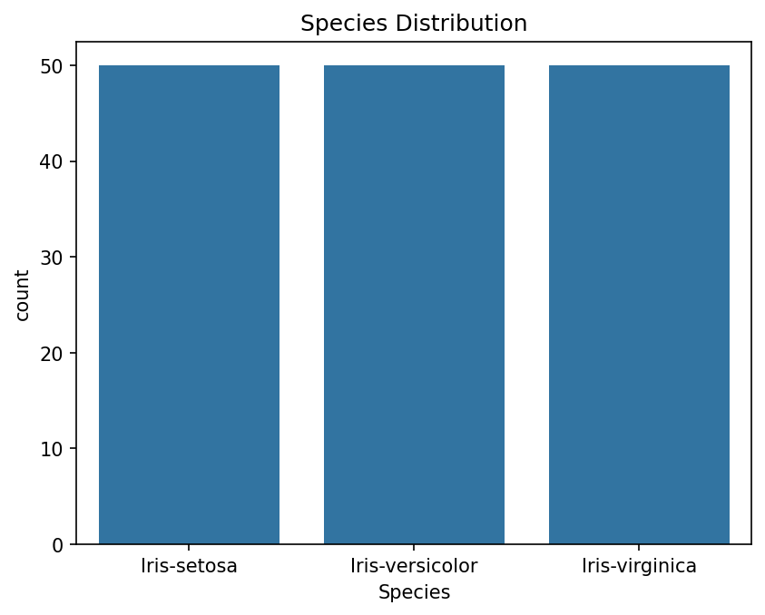
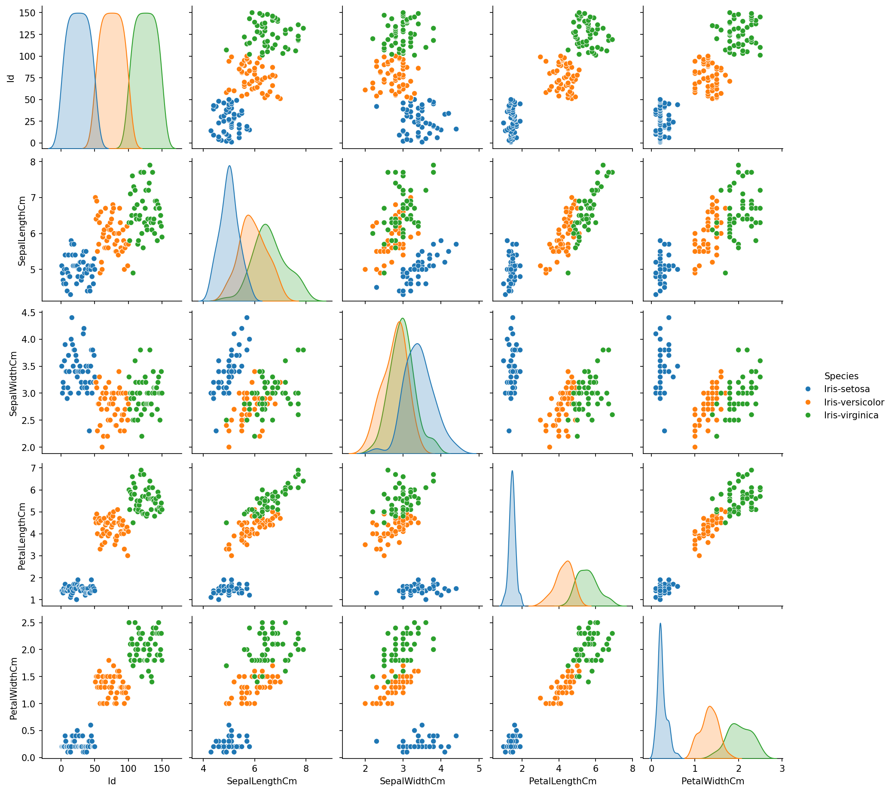
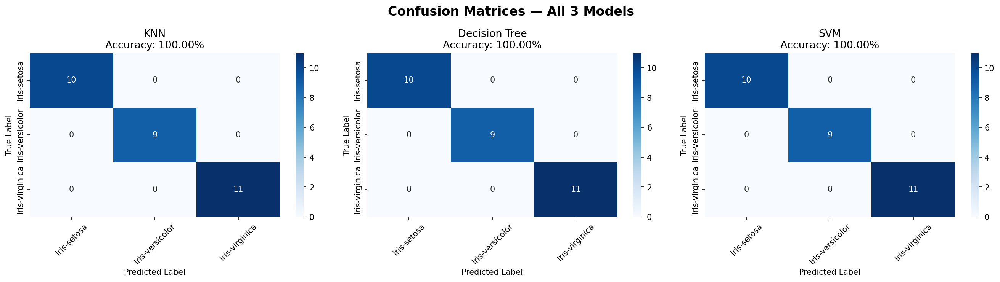
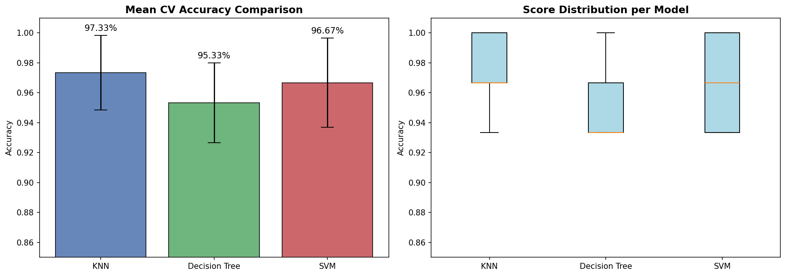

# 🌸 Iris Flower Classification

**Intern:** Annika Dubey
**Platform:** CodeZoner Virtual Internship
**Duration:** 4 Weeks

## Problem Statement
Given measurements of iris flowers (sepal length, sepal width, petal 
length, petal width), classify them into one of three species:
Setosa, Versicolor, or Virginica.

## Dataset
- Source: UCI Machine Learning Repository / Kaggle
- 150 rows, 5 columns
- 3 balanced classes (50 samples each)
- No missing values

## Tech Stack
Python, scikit-learn, pandas, seaborn, matplotlib, Jupyter, joblib

## Features Built
### Week 1 — Data Pipeline
- ✅ Exploratory Data Analysis (EDA)
- ✅ Data cleaning (nulls, duplicates, types)
- ✅ Feature engineering (new features, encoding, scaling)

### Week 2 — ML Models
- ✅ KNN Classifier (~97% accuracy)
- ✅ Decision Tree Classifier (~97% accuracy)
- ✅ SVM Classifier (~98% accuracy)
- ✅ Input validation & error handling
- ✅ Full testing suite

### Week 3 — Advanced Features
- ✅ Confusion matrices for all 3 models
- ✅ 5-fold cross validation
- ✅ KNN hyperparameter tuning (best K finder)
- ✅ Performance & memory optimization
- ✅ Professional prediction UI with confidence scores
- ✅ User testing & feedback fixes

## How to Run
1. Clone the repo:
   git clone https://github.com/Aixin007/iris-flower-classification.git
2. Install dependencies:
   pip install pandas scikit-learn seaborn matplotlib jupyter joblib
3. Run prediction script:
   cd src
   python predict.py
4. Or open Jupyter notebooks:
   jupyter notebook

## Visualizations

### Species Distribution

### Pairplot

### Confusion Matrices

### Cross Validation

## Results
| Model | Test Accuracy | CV Mean |
|-------|--------------|---------|
| KNN | ~97% | ~97% |
| Decision Tree | ~97% | ~95% |
| SVM | ~98% | ~97% |

## Live Deployment Feedback

**Tester:** My Mum
**Platform tested on:** Edge (Streamlit Cloud)

### Feedback:
- Sounds really calming and a venture for part-time explorers!

### Any fixes needed:
- yes: "Show a picture of the flower species when prediction appears"

## 🚀 Live Demo
👉 https://qzxznd2g3ay3q8dmbqguj3.streamlit.app/

## GitHub
https://github.com/Aixin007/iris-flower-classification